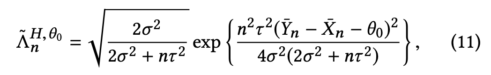

An implementation of A/B testing with peeking, a statistical correction that allows for watching p-values

## Installation

```bash
git clone git@github.com:ezcater/continuous-ab-testing.git
python3 -m pip install -e continuous-ab-testing
```

## Usage

```python
import abpeeking.p_values as p_values
A = [2, 3, 4, 5, 6]
B = [4, 5, 6, 7]
print(p_values.calculate(A, B))
```

### Special case: Aggregated data

In the case where you have aggregated values--count, mean, and variance--
instead of the raw data, you can use this variation. This appears to be
the default constraint when working with Tableau.

```python
import numpy as np
import abpeeking.p_values as p_values

A = np.array([2, 3, 4, 5, 6])
B = np.array([4, 5, 6, 7])
count_a = A.size
count_b = B.size
mean_a = np.mean(A)
mean_b = np.mean(B)
var_a = np.var(A, ddof=1)
var_b = np.var(B, ddof=1)

print(
    p_values.calcuate_with_aggregates(
        count_a, count_b, mean_a, mean_b, var_a, var_b
    )
)
```


## Background
Peeking is when you perform ongoing significance testing on your A/B test
(as we do when we add p-values and statistical significance to a dashboard), rather than waiting for it to play
out for a fixed number of samples and calculating significance just once.

This approach is based on the paper
[Peeking at A/B Tests: Why it matters, and what to do about it](http://library.usc.edu.ph/ACM/KKD%202017/pdfs/p1517.pdf)
by Ramesh Johari, Pete Koomen, Leonid Pekelis, and David Walsh.
It develops a variant of p-value that lets you check it as often as you like without introducing a bias
for false positives (as illustrated in [this xkcd](https://xkcd.com/882/)).

The key result is Equations 11 from the paper.



Technically it's for Normally-distributed data but we can
fudge this qualification criterion, thanks to the magic of statistics, a.k.a. the Central Limit Theorem.

tau = 1 seems to be a good, justifiable place to start. Making it larger is a way to manually get more aggressive–you get lower p-values faster but with a higher chance of false positives. Optimizely’s secret sauce is a combination of simulation studies, user studies, and empirical analyses on their data to determine how best to tweak this.
